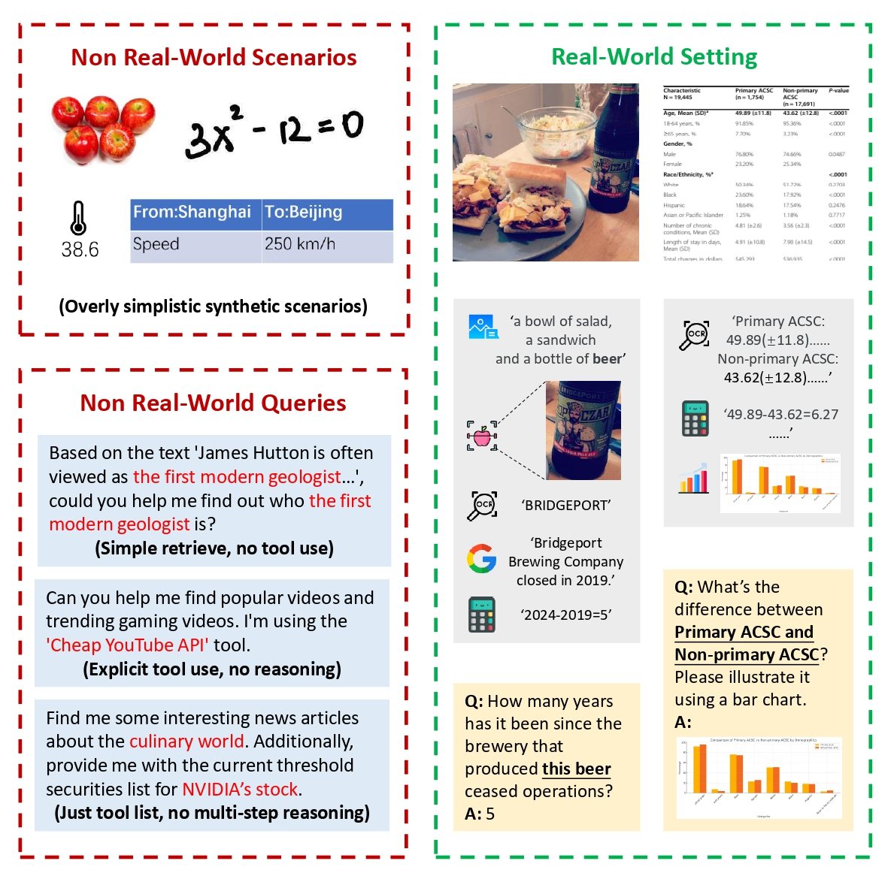
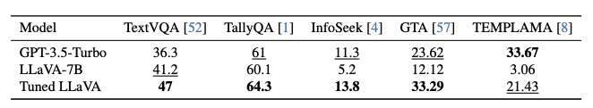

# ToolVQA: A Dataset for Real-World VQA with External Tools


## 1. Introduction 📣 

>Integrating external tools into Large Foundation Models (LFMs) has emerged as a promising approach to enhance their problem-solving capabilities. While existing studies have demonstrated strong performance in tool-augmented Visual Question Answering (VQA), recent benchmarks reveal significant gaps in real-world tool-use proficiency, particularly in functionally diverse multimodal settings requiring multi-step reasoning.  

In this work, we introduce **ToolVQA**, a large-scale multimodal dataset comprising **23K** instances, designed to bridge this gap. Unlike previous datasets that rely on synthetic scenarios and simplified queries, ToolVQA features real-world visual contexts and challenging implicit multi-step reasoning tasks, better aligning with real user interactions.
To construct this dataset, we propose ToolEngine, a novel data generation pipeline that employs Depth-First Search (DFS) with a dynamic in-context example matching mechanism to simulate human-like tool-use reasoning. ToolVQA encompasses 10 multimodal tools across 7 diverse task domains, with an average inference length of 2.78 reasoning steps per instance.  

<div align="center">
 
</div>

The fine-tuned 7B LFMs on ToolVQA not only achieve impressive performance on our test set but also surpass the large close-sourced model GPT-3.5-turbo on various out-of-distribution (OOD) datasets, demonstrating strong generalizability to real-world tool-use scenarios.

<div align="center">
 
</div>

For more details, please check the original paper.

## 2. Implemention 🚀

### 2.1 Environments

We utilize four open source frameworks to complete our code:

1. [Lmdeploy](https://github.com/InternLM/lmdeploy): deploy LFM locally for training or testing.
2. [Agentlego](https://github.com/InternLM/agentlego): deploy external tools and call them through API.
3. [Opencompass](https://github.com/open-compass/opencompass): combine lmdeploy and agentlego to evaluate LFM.
4. [Xtuner](https://github.com/InternLM/xtuner): fine-tune LFM through well-defined configs.

We highly recommend you to use four different virtual environments to deploy these frameworks **separately**, rather than installing all of them in one environment.  We have exported the deployed environments under the `requirements/` directory, and you can directly `pip install` them.

>Our implementation also refers to [GTA](https://github.com/open-compass/GTA), and we would like to pay high tribute to all of these great open source work!

### 2.2 Dataset

You can download the dataset from [Google Drive](https://drive.google.com/drive/folders/1diRjF2jK0aHoAMximnT7jNg4eN96ppCp?usp=sharing).

There are three files in our dataset:

1. `toolvqa_imgs.zip`: 23655(21105+2550) images, each image corresponds to an instance of ToolVQA. Please put these images under directory `datasets/ToolVQA/`.
2. `raw_train_21105.json`: 21105 training instances.
3. `raw_test_2550.json`: 2550 test instances.
   
Each instance is in the format of:
```python
{
    "image_path": "datasets/ToolVQA/2412880.jpg",
    "context": [
        {
            "name": "ImageDescription", # tool name, listed in file 'agentlego/benchmark_toollist.txt'
            "thought": "To solve the problem, we begin by getting a general understanding of the image showing animals used for a specific purpose—in this case, draft horses pulling a plow.", # thought of use this tool in solving process
            "thought_choose": "There is only one choice, so we will directly use it.", # thought of choose this tool in data generating process 
            "input": {
                "image": "datasets/ToolVQA/2412880.jpg"
            }, # tool input
            "output": "The image shows a person riding on a plow being pulled by two draft horses through a field. The person is operating farming equipment, likely for plowing or preparing the land. The scene is set in an outdoor, rural environment, with trees in the background.", # tool output
            "thought_query": "Since we don't know the information in the picture, we first call tool ImageDescription to describe the picture.", # thought of use this tool+input in data generating process  
            "is_important": "yes" # [test set only] human annotated: whether this tool is necessary for solving process (used to calculate Redundancy rate in paper)
        },
        ... # other tool-use steps
    ],
    "question": "What is a common breed of these animals used historically for plowing?", # query
    "ori_question": "What is a common breed of the draft horses in this image used historically for plowing?", # query before gpt-based refinement
    "thought_rethink": "The noun 'draft horses' appears in the ImageDescription. I will replace 'draft horses' with 'these animals' since the question is asking about the specific horses shown in the image.\n\n", # thought of gpt-based refinement
    "thought_question": "The last tool used is the GoogleSearch, which indicates that Percherons are a common breed of draft horses historically used for plowing. The image shows two draft horses being used for plowing, and instead of directly asking about the breed, I should reference the activity in the image. I will avoid mentioning the breed of the horses explicitly and frame the question based on the image description to ensure it can be answered by the information provided by the tool call.", # thought of query
    "answer": "Percherons", # answer
    "type": "multi_obj_no_text", # instance type [multi_obj_no_text / single_obj_no_text / obj_text / no_obj_text] 
    "better_ques": "2", # [test set only] human annotated: whether refined query better than original query (1: yes, 2: no, 3: equal)
    "only_answer": "1", # [test set only] human annotated: whether better query have only one answer (1: yes, 0: no)
    "correct_answer": "yes" # [test set only] human annotated: whether the answer of better query is correct
},
```

### 2.3 Data Construction

This part requires `agentlego` environment.

#### 1. Deploy the tools.

```shell
conda activate agentlego
export OPENAI_API_KEY='your_openai_api_key'
export SERPER_API_KEY='your_serper_key_for_google_search_tool' # API for Google Search, register at 'https://serper.dev'
cd agentlego
agentlego-server start --port 16181 --extra ./custom_tools.py  `cat toollist.txt` --host 0.0.0.0
```

#### 2. Preprocess your data. 

Process your custom image and its tag (choose from `[multi_obj_no_text / single_obj_no_text / obj_text / no_obj_text]`) into a dictionary list. In the format of:
```python
[
    {
        "image": "your_file_path.jpg",
        "tag": "multi_obj_no_text"
    },
    ...
]
```
Please put your data at `agentlego/datasets/datas.json`.

#### 3. Generate your data.

(1) If you want to generate VQAs for a specific toolchain, run:
```shell
cd agentlego/annotators
python build_fix.py
```
Your can change the specific toolchain in line 39 of `build_fix.py`. In addition, the code in this file is multi-threaded concurrent. If you want to use the single-threaded version, please refer to the function `build_epoch_fixed` in `build_epoch.py` and call it directly.

(2) If you want to generate VQAs for arbitrary toolchains, run:
```shell
cd agentlego/annotators
python build_any.py
```

### 2.4 Fine-tuning

This section requires `xtuner` environment.

Refer to [https://xtuner.readthedocs.io/zh-cn/latest/training/multi_modal_dataset.html](https://xtuner.readthedocs.io/zh-cn/latest/training/multi_modal_dataset.html).

Possible issues: 

1. [The fine-tuned model cannot be converted to huggingface format?](https://github.com/InternLM/xtuner/issues/835)
2. [The merged model cannot be started?](https://github.com/InternLM/lmdeploy/issues/2036)

### 2.5 Evaluation

This section requires `opencompass`, `lmdeploy`, and `agentlego` environments.

#### 1. Deploy the tools.
```shell
cd agentlego

source setup.sh 
# This step includes an export proxy=8890 operation. If the corresponding clash is not opened, an error will be reported.

agentlego-server start --port 16181 --extra ./custom_tools.py  `cat toollist.txt` --host 0.0.0.0 
# --port can specify any port, but the corresponding port must be changed in eval_config later.
# The deployment of this api will occupy about 2G memory, but for unknown reasons, the memory usage will gradually increase during testing, so it is best to reserve about 6G.
```

####  2. Start local LFMs' api.

[Note](): If you are testing api-based LLM, you can skip this step.

```shell
conda activate lmdeploy

lmdeploy serve api_server path/to/models --server-port 12580 --model-name your_model_name
# This port can also be specified arbitrarily, and also needs to be changed in eval_config.
# A model basically takes up an entire card's 24G memory.
```

#### 3. Run evaluations.

```shell
cd opencompass
conda activate opencompass

# evaluate from scratch:
python run.py path/to/your_eval_config -p llmit -q auto --max-num-workers 32 --debug --eval_mode=your_eval_mode
# args guideline: opencompass/configs/readme.md
# default output dir: opencompass/outputs/default
# If the test above is interrupted halfway, you can add --reuse 2024xxxx (the file name of the test output, you can also rename it yourself) to the test command and continue the test.

# want to run the metric again:
python run.py path/to/your_eval_config --max-num-workers 32 --debug --reuse your_output_name --mode eval --eval_mode=your_eval_mode
```
